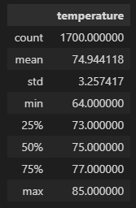
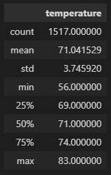

# Surfs_up

## Overview
Obtain the temperature data for the months of June and December in Oahu, in order to determine if the surf and ice cream shop business is sustainable year-round

## Results
The results of the analysis indicate that the average temperature in both June and December support the operation of surf and ice cream shop business year-round as indicated below:
* Temperatures for June are favorable for both surfing and ice cream

  
* Temperatures for December are favorable for boeth surfing and ice cream
  
 
* Both months show favorable temperatures to enjoy both surfing and ice cream year-round as detailed in the tables above.

Data source link: [hawaii.sqlite](hawaii.sqlite)
## Summary
A detailed breakdown of the temperature data reveals that in June the average temperature is 74.9°F with a max of 85°F and December revealing an average temperature of 71°F and a max of 83°F. Looking only at the temperature data, the results indicate favorable conditions year-round to enjoy both surfing and ice cream.

Additional weather queries would further provide insight into the enjoyment of surfing and ice cream year-round. Such queries include the following:
1) Analyzing the time of day and length of favorable conditions for both surfing and ice cream in both June and December.
2) Adding a query for rainy-day data
